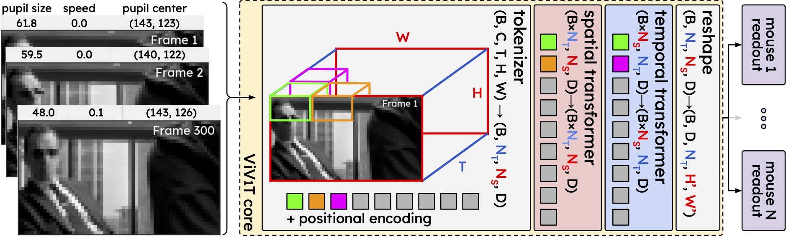

# ViV1T: dynamic mouse V1 response predicting using a factorized spatiotemporal Transformer

Codebase for the ViV1T (team `dunedin`) submission in the [NeurIPS Sensorium 2023 challenge](https://www.sensorium-competition.net/) which came 🥉 place.



Contributors: [Bryan M. Li](https://twitter.com/bryanlimy), [Wolf De Wulf](https://twitter.com/wolfdewulf), [Nina Kudryashova](https://twitter.com/NinelK1), [Matthias Hennig](https://twitter.com/MatthiasHennig6), [Nathalie L. Rochefort](https://twitter.com/RochefortLab), [Arno Onken](https://homepages.inf.ed.ac.uk/aonken/).

## Acknowledgement

We sincerely thank [Turishcheva et al.](https://arxiv.org/abs/2305.19654) for organizing the [Sensorium 2023](https://sensorium2022.net/home) challenge and for making their high-quality large-scale mouse V1 recordings publicly available. The structure of this codebase is based on and inspired by [bryanlimy/V1T](https://github.com/bryanlimy/V1T), [ecker-lab/sensorium_2023](https://github.com/ecker-lab/sensorium_2023), [sinzlab/neuralpredictors](https://github.com/sinzlab/neuralpredictors) and [sinzlab/nnfabrik](https://github.com/sinzlab/nnfabrik). 

## File structure
The codebase repository has the following structure. 
- Check [data/README.md](data/README.md) for more information about the dataset and how to store them.
- Check [.gitignore](.gitignore) for the ignored files.
```
ViV1T/
  assets/
  data/
    sensorium/
      dynamic29156-11-10-Video-8744edeac3b4d1ce16b680916b5267ce.zip
      dynamic29228-2-10-Video-8744edeac3b4d1ce16b680916b5267ce.zip
      ...
    README.md
  runs/
    vivit_ensembe/
      002/
        ckpt/
          model_stat.pt
        args.yaml
        evaluation.yaml
        model.txt
        output.log
      009/
      012/
      015/
      028/
  src/
    sensorium/
      ...
  .gitignore
  demo.ipynb
  LICENSE
  pyproject.toml
  README.md
  requirements.txt
  train.py
```

## Installation
Create conda envrionment `viv1t` in Python 3.11, install [PyTorch](https://pytorch.org/get-started/locally/) 2.1 and the `viv1t` package.
```bash
conda create -n viv1t python=3.11
conda activate viv1t
pip install torch==2.1 torchvision torchaudio
pip install -e .
```

## Demo
[`demo.ipynb`](demo.ipynb) contains a demo notebook to initialize, restore and inference the model, as well as generating the parquet files that were used in the challenge submission.


## Train model
- The following command train the ViV1T core and Gaussian2d readout model on all 10 mice and save results to `--output_dir=runs/vivit/test`:
  ```
  > python train.py --data=data/sensorium --output_dir=runs/vivit/test --transform_mode=2 --crop_frame=140 --ds_mode=3 --core=vivit --core_parallel_attention --grad_checkpointing=0 --output_mode=1 --readout=gaussian2d --batch_size=6 --clear_output_dir
  ```
- Training progress will be printed in the console and also recorded in `<output_dir>/output.log` and model checkpoint is saved periodically in `<output_dir>/ckpt/model_stat.pt`.
- Check `--help` for all available arguments
  ```
  > python train.py --help

  usage: train.py [-h] [--data DATA] --output_dir OUTPUT_DIR --ds_mode {0,1,2,3} [--stat_mode {0,1}] --transform_mode
                  {0,1,2,3,4} [--center_crop CENTER_CROP] [--mouse_ids MOUSE_IDS [MOUSE_IDS ...]] [--limit_data LIMIT_DATA]
                  [--cache_data] [--num_workers NUM_WORKERS] [--epochs EPOCHS] [--batch_size BATCH_SIZE]
                  [--micro_batch_size MICRO_BATCH_SIZE] [--crop_frame CROP_FRAME] [--device {cpu,cuda,mps}] [--seed SEED]
                  [--deterministic] [--precision {32,bf16}] [--grad_checkpointing {0,1}] [--restore RESTORE]
                  [--adam_beta1 ADAM_BETA1] [--adam_beta2 ADAM_BETA2] [--adam_eps ADAM_EPS] [--criterion CRITERION]
                  [--ds_scale {0,1}] [--grad_norm GRAD_NORM] [--save_plots] [--dpi DPI] [--format {pdf,svg,png}]
                  [--wandb WANDB] [--wandb_id WANDB_ID] [--clear_output_dir] [--verbose {0,1,2,3}] --core CORE
                  [--core_compile] --readout READOUT [--shifter_mode {0,1,2}] [--modulator_mode {0,1,2,3,4}]
                  [--critic_mode {0,1}] [--output_mode {0,1,2}]

  options:
    -h, --help            show this help message and exit
    --data DATA           path to directory where the dataset is stored.
    --output_dir OUTPUT_DIR
                          path to directory to log training performance and model checkpoint.
    --ds_mode {0,1,2,3}   0: train on the 5 original mice
                          1: train on the 5 new mice
                          2: train on all 10 mice jointly
                          3: train on all 10 mice with all tiers from the 5 original mice
    --stat_mode {0,1}     data statistics to use:
                          0: use the provided statistics
                          1: compute statistics from the training set
    --transform_mode {0,1,2,3,4}
                          data transformation and preprocessing
                          0: apply no transformation
                          1: standard response using statistics over trial
                          2: normalize response using statistics over trial
                          3: standard response using statistics over trial and time
                          4: normalize response using statistics over trial and time
    --center_crop CENTER_CROP
                          center crop the video frame to center_crop percentage.
    --mouse_ids MOUSE_IDS [MOUSE_IDS ...]
                          Mouse to use for training.
    --limit_data LIMIT_DATA
                          limit the number of training samples.
    --cache_data          cache data in memory in MovieDataset.
    --num_workers NUM_WORKERS
                          number of workers for DataLoader.
    --epochs EPOCHS       maximum epochs to train the model.
    --batch_size BATCH_SIZE
    --micro_batch_size MICRO_BATCH_SIZE
                          micro batch size to train the model. if the model is being trained on CUDA device and micro batch size 0 is provided, then automatically increase micro batch size until OOM.
    --crop_frame CROP_FRAME
                          number of frames to take from each trial.
    --device {cpu,cuda,mps}
                          Device to use for computation. use the best available device if --device is not specified.
    --seed SEED
    --deterministic       use deterministic algorithms in PyTorch
    --precision {32,bf16}
    --grad_checkpointing {0,1}
                          Enable gradient checkpointing for supported models if set to 1. If None is provided, then enable by default if CUDA is detected.
    --restore RESTORE     pretrained model to restore from before training begins.
    --adam_beta1 ADAM_BETA1
    --adam_beta2 ADAM_BETA2
    --adam_eps ADAM_EPS
    --criterion CRITERION
                          criterion (loss function) to use.
    --ds_scale {0,1}      scale loss by the size of the dataset
    --grad_norm GRAD_NORM
                          max value for gradient norm clipping. set None to disable
    --save_plots          save plots to --output_dir
    --dpi DPI             matplotlib figure DPI
    --format {pdf,svg,png}
                          file format when --save_plots
    --wandb WANDB         wandb group name, disable wandb logging if not provided.
    --wandb_id WANDB_ID   wandb run ID to resume from.
    --clear_output_dir    overwrite content in --output_dir
    --verbose {0,1,2,3}
    --core CORE           The core module to use.
    --core_compile        compile core module with inductor backend via torch.compile
    --readout READOUT     The readout module to use.
    --shifter_mode {0,1,2}
                          0: disable shifter
                          1: learn shift from pupil center
                          2: learn shift from pupil center and behavior variables
    --modulator_mode {0,1,2,3,4}
                          0: disable modulator
                          1: MLP Modulator
                          2: GRU Modulator
                          3: MLP-v2 Modulator
                          4: MLP-v3 Modulator
    --critic_mode {0,1}
    --output_mode {0,1,2}
                          Output activation:
                          0: ELU + 1 activation
                          1: Exponential activation
                          2: SoftPlus activation
  ```